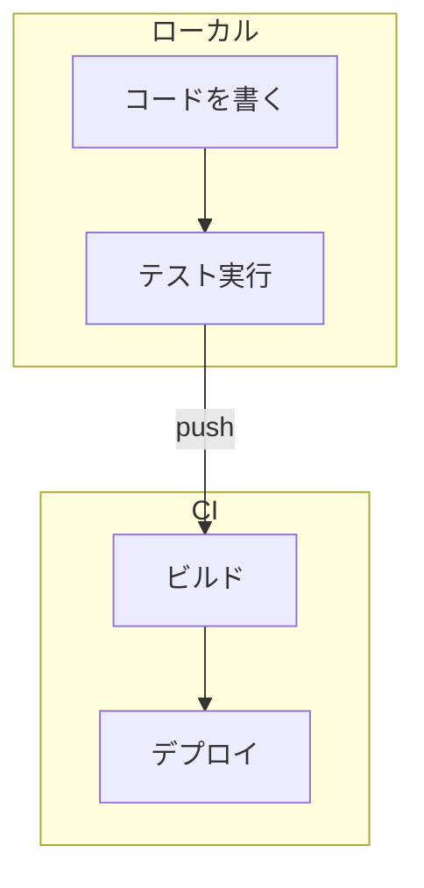
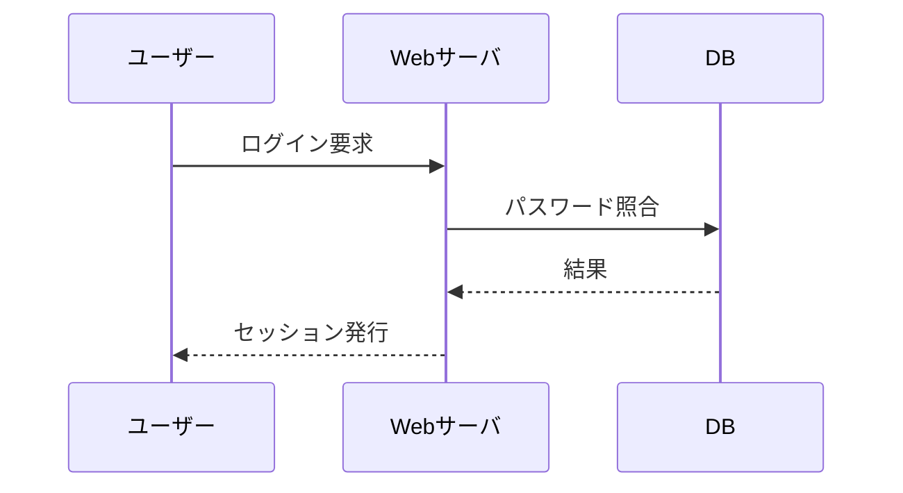
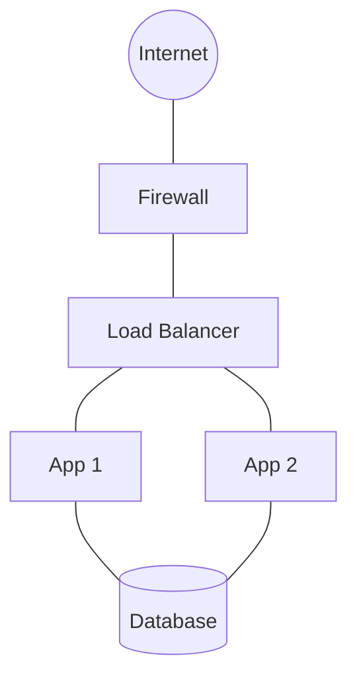

# mermaid-inline.nvim demo

## 開発フロー

```mermaid
flowchart TD
  subgraph ローカル
    A[コードを書く] --> B[テスト実行]
  end
  subgraph CI
    C[ビルド] --> D[デプロイ]
  end
  B -->|push| C
```

## ログイン処理

```mermaid
sequenceDiagram
  participant U as ユーザー
  participant W as Webサーバ
  participant D as DB
  U->>W: ログイン要求
  W->>D: パスワード照合
  D-->>W: 結果
  W-->>U: セッション発行
```

## Network

```mermaid
flowchart TD
  I((Internet)) --- FW[Firewall]
  FW --- LB[Load Balancer]
  LB --- A1[App 1]
  LB --- A2[App 2]
  A1 --- DB[(Database)]
  A2 --- DB
```
