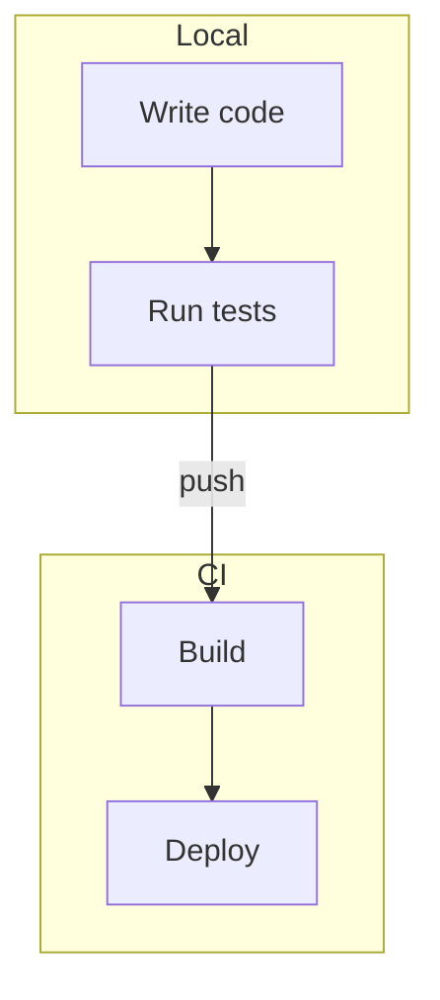
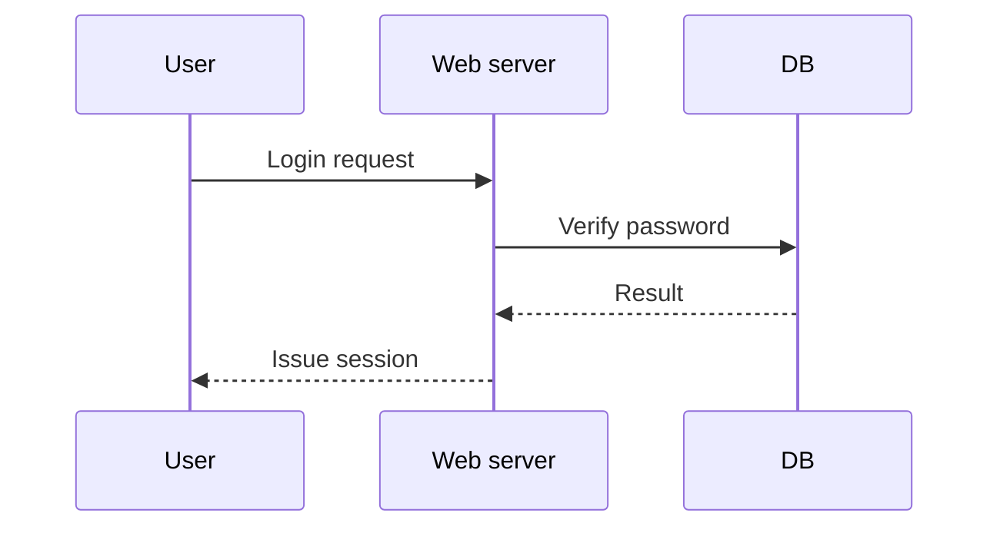
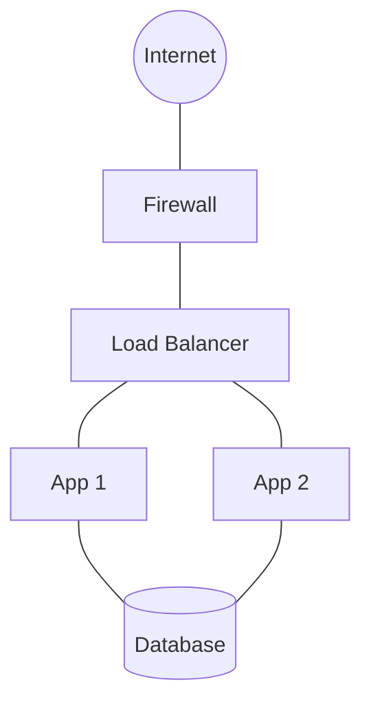

# mermaid-inline.nvim demo

## Development flow

```mermaid
flowchart TD
  subgraph Local
    A[Write code] --> B[Run tests]
  end
  subgraph CI
    C[Build] --> D[Deploy]
  end
  B -->|push| C
```

## Login

```mermaid
sequenceDiagram
  participant U as User
  participant W as Web server
  participant D as DB
  U->>W: Login request
  W->>D: Verify password
  D-->>W: Result
  W-->>U: Issue session
```

## Network

```mermaid
flowchart TD
  I((Internet)) --- FW[Firewall]
  FW --- LB[Load Balancer]
  LB --- A1[App 1]
  LB --- A2[App 2]
  A1 --- DB[(Database)]
  A2 --- DB
```
